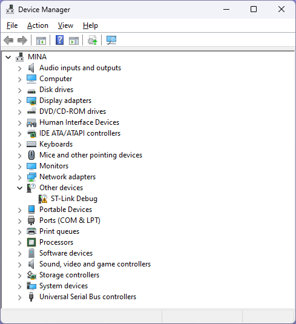
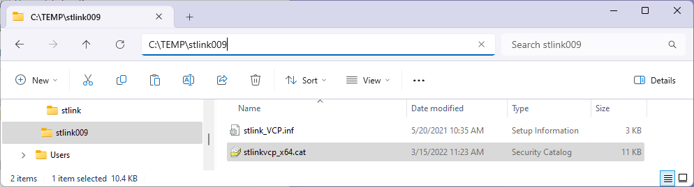
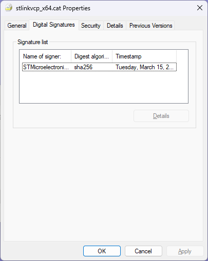
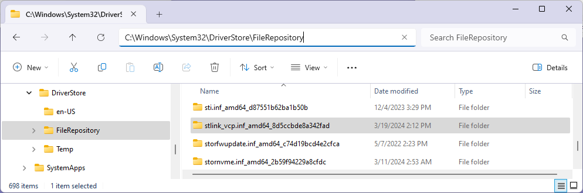

# ドライバーのインストールとは？

DriverInstallation.md

- **What is Driver Installation?**
- [Driver installation method](HowToInstall.md)
- [Driver update and deletion](UpdateAndDeletion.md)

----

## What is Driver Installation?

If the required drivers for your device are not installed on your machine, you will need to install a device driver (hereinafter referred to as driver).
Where does that driver come from and how is it installed?

To understand it, you first need to know what a driver installation is and the elements that make up a driver installation.

 
(Driver not installed)

### Precise instructions for installing drivers

Installing a Windows driver is a little different from an application program and refers precisely to the following series of actions:

- Check all files and signatures, permissions and access rights required for INF and driver operation
- Copy or check the existence of files necessary for operation to the specified location
- Start the driver program with necessary privileges
- Completed driver program initialization process

In other words, installing a driver means starting the driver program and completing the initialization process one or more times.
When the target device is connected or powered on, the Plug and Play Manager searches for the most suitable driver package, launches it, and installs the driver.

Drivers required for Windows operation are prepared in advance under C:\Windows along with other Windows kernel modules when Windows is installed.
On the other hand, driver packages required depending on the operating status of Windows and the connection status of peripheral devices are placed in the driver store.

### Driver Package

The INF, driver binaries (.SYS, DLL, ...), catalog files, and other files required for driver installation are collectively called a driver package. A driver package is a collection of all the files necessary for installation.

Depending on various conditions, it is possible to omit the driver binary and security catalog, but INF cannot be omitted. All file names included in the driver package are written in the INF. The catalog (.CAT) file validates that the INF and all driver package files listed in the INF have not been modified since creation. Requires SHA256 signature. In other words, if anything in a driver package is changed, including the INF, that driver package becomes unsigned and cannot be used as a driver.

 
(Simple driver package example)

 
(CAT files must have a SHA256 signature)

### Driver Store

This is the storage location for all driver packages used by the machine, including the preinstalled ones described below.
Located at **C:\Windows\System32\DriverStore**.
In other words, if you save (back up) all of this directory, you can recreate the exact same driver environment as the previous machine when a problem occurs or when you reinstall after replacing the disk.
Machines that have proprietary drivers, such as machines that come with manufacturer's Windows installed, will also have all driver packages in this location.

 
(Example contents of the FileRepository folder in the driver store)

Sometimes, due to disk problems or incorrect operations, the original driver may be deleted.
However, if the driver store is backed up, it can be restored.

The Driver Store also stores different versions of drivers for the same device, so you can recover any old driver package as long as you don't delete it.

Many operations that copy driver packages from the user's media, commonly referred to as "driver installations," are actually copies of driver packages to the driver store, or preinstallations.
However, to make the terminology easier to understand, in the following explanation, the preinstallation operation, including the exact installation operation described above, will be collectively referred to as installation.

### Installation with Windows Update

Windows Update uses the Plug and Play Manager to examine all device information on a target machine, download drivers for devices that have the latest or missing drivers, and copy them to the driver store.
When searching for drivers in Device Manager, the "Search for updated drivers on Windows Update" option does this.

In order to be searchable on Windows Update, device and driver manufacturers must register their drivers on Windows Update and publish them for applicable PCs.
Therefore, only certain registered drivers can be installed from Windows Update.

### Installation log file

All driver installation logs are stored in **C:\Windows\INF\setupapi.dev.log** in [SetupAPI text log format](https://learn.microsoft.com/windows-hardware/drivers/install/setupapi-text-logs?WT.mc_id=WDIT-MVP-35878).
