# Driver installation method

HowToInstall.md

- [What is Driver Installation?](DriverInstallation.md)
- **Driver installation method**
- [Driver update and deletion](UpdateAndDeletion.md)

----

## Driver installation method

Driver installation is a series of steps from copying the driver package to the driver store to completing the driver initialization process. There are the following scenarios (methods) for driver installation:

- Device first
- Driver first
- Other drivers
- TXTSETUP.OEM

When it is necessary to install a driver, the device manufacturer usually specifies instructions for installing the driver or provides an installation program, so users are unlikely to actually install the driver using these instructions.

However, it is good knowledge to have in case driver problems occur when updating the Windows OS, or when the manufacturer releases a new version of the driver, or there may be problems with the automatic installation of standard drivers as described below.

## Device-first sequencing

Either connect the device to the PC first, or turn on the connected device.
This also applies when a software device (virtual device) starts working.

When Windows' Plug and Play Manager detects a new device, it searches for a matching driver (actually INF) in the INF folder (**C:\Windows\INF**) and driver store and installs it.
If the driver is not found, a device with a yellow triangle mark indicating that the driver is not installed will be displayed in the device manager, like the ST-Link Debug device below.

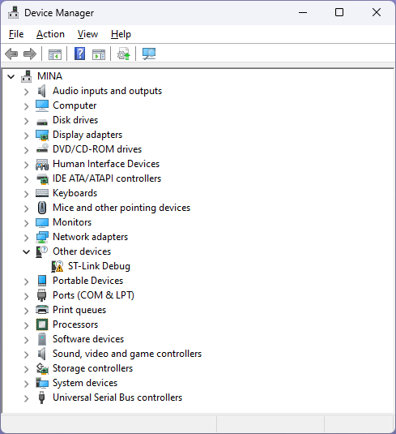
<br/>
(Devices with a yellow triangle mark indicating that the driver is not installed)

When you open this driver-less device, you will see the device status "This driver is not installed" as shown below.

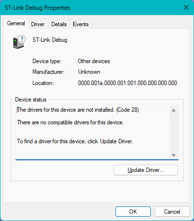
<br/>
(This ST-Link Debug device driver is not installed)

In this scenario, if Plug and Play Manager finds a suitable driver, it immediately begins installing the driver.
Since the driver package is already pre-installed, this is the driver-first scenario described in the next section.

 ### Installation instructions

This section describes the installation procedure from an undetected state in a device-first scenario. We will continue to explain using an uninstalled ST-Link Debug device as an example. First, check the driver package file or folder provided by the target device manufacturer or prepare it in local storage.

The driver package may be on a CD-ROM or USB memory. Depending on your device, you may be able to download and install it using Windows Update. In this example of the ST-Link Debug device, we have downloaded the en.stsw-link009.zip driver from the STMicroelectronics website, so we will unzip it and use it.

Right-click the device that does not have a driver installed and select **Update Driver** to start the installation.

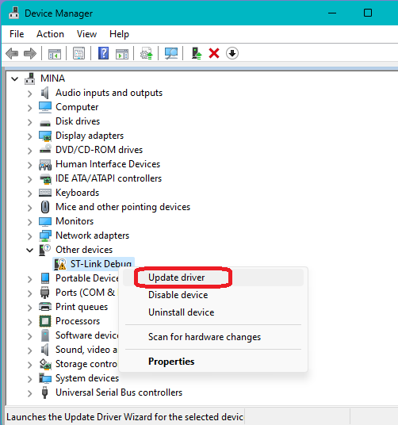
<br/>
(Right-click his ST-Link Debug with no driver installed and select Update Driver)

In the next dialog that appears, click **Browse my computer for drivers** to proceed.

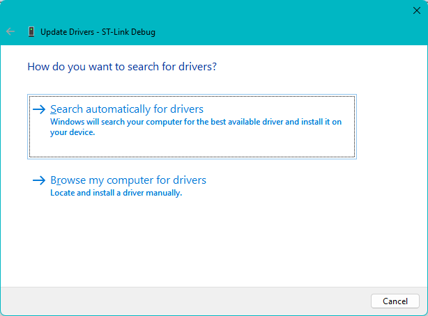
<br/>
(Update Driver Dialog Browse my computer for drivers)

The driver package folder selection screen will appear, so click **Select from a list of available drivers on my computer** to proceed.

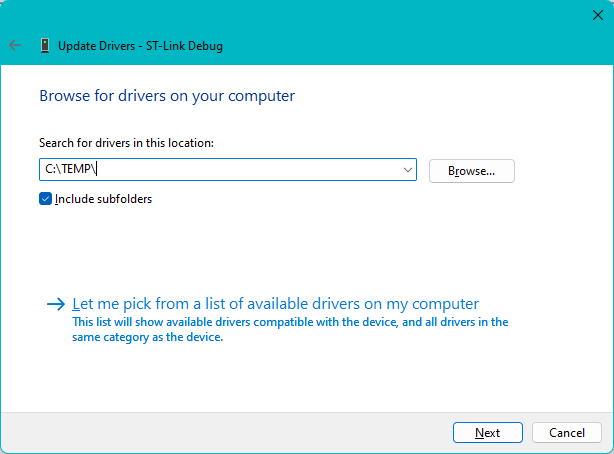
<br/>
(Update Driver Dialog, Select from a list of available drivers on your computer)

Click **Next** to proceed.

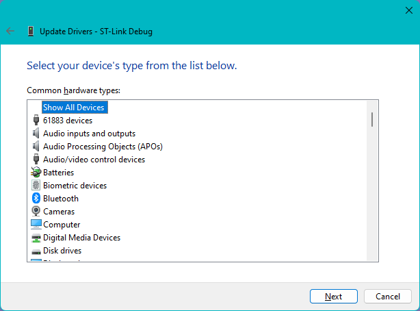
<br/>
(Update Driver Dialog Select from a list of available drivers on your computer)

Click **Have Disk** to proceed.

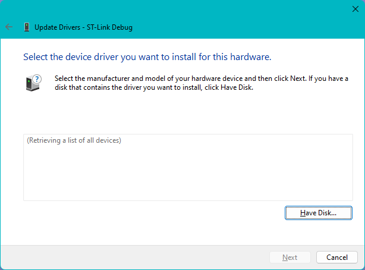
<br/>
(Update driver dialog **Have disk** button)

Click Browse and specify the location of the extracted folder (driver package).

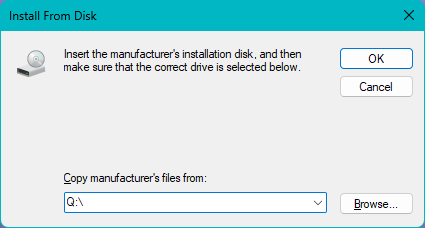
<br/>
(Dialog for Installing from Disk)

When you specify a file location, only files with the INF extension are displayed.
If there are multiple INFs like this, they will be installed in each folder, so it doesn't matter which one you specify.

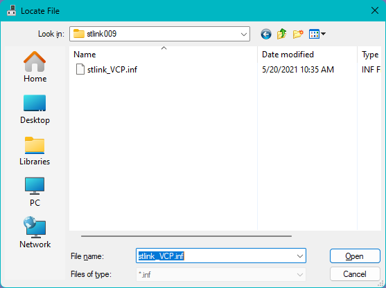
<br/>
(**INF file location** specification)

Now that you have determined the location of the folder containing the INF as shown below, click **OK** to proceed.

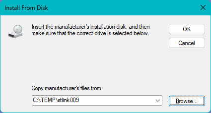
<br/>
(**Install from Disk** dialog, confirm folders)

**Confirm the device name you want to install** and click **Next** to proceed.

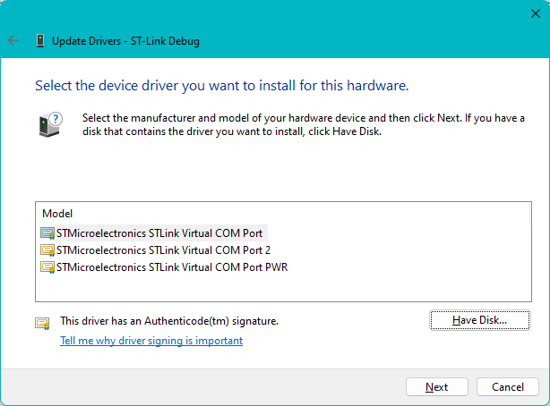
<br/>
(Update Drivers, Check Model name and signature)

A dialog indicating that the driver update is complete will be displayed. Indicates that the initialization process has completed successfully and the installation is complete.

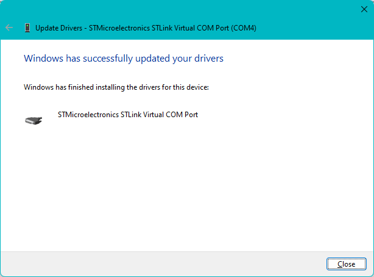
<br/>
(Driver update updated successfully)

### Automatic installation of standard drivers and compatibility issues

With the evolution of Windows, many compatible drivers are now available pre-installed (standard INF and driver store).
As a result, the occurrence of the yellow triangle mark "without driver" mentioned above has been reduced.
However, the driver that maximizes the performance of each device (the optimal driver) is not always automatically installed.

When installing new hardware, the automatic installation completes without error, so it appears that the installation of the device has been completed successfully, but because the driver is not the optimal one, the device may not actually be able to utilize its original functions and performance. , problems are occurring.

Device identification is mainly done by hardware ID, which consists of vendor ID, product ID, etc., and compatibility ID.
As devices become more diverse and various manufacturers release a variety of new devices, Windows cannot always provide the optimal drivers.

Users should be careful to install the most suitable driver for their purpose. If an incompatible driver is unintentionally installed automatically when you attach the device or turn on the power, prepare the installation media and install it from a state where the driver is not installed using the same steps described above. You can install the driver.

[Reference link: Hardware ID](https://learn.microsoft.com/windows-hardware/drivers/install/hardware-ids?WT.mc_id=WDIT-MVP-35878)

[Reference link: Compatibility ID](https://learn.microsoft.com/windows-hardware/drivers/install/compatible-ids?WT.mc_id=WDIT-MVP-35878)
 
## Driver first sequencing

In this scenario, copy the driver package to the driver store before describing the device.
Therefore, you can install the driver even if you do not have the actual device to use.
The driver installation is truly completed when the device is actually connected and the driver initialization is completed.

Adding driver packages in a driver-first scenario can be done in a variety of ways.
This may be done by installing installation media or download packages provided by the manufacturer with the device.

Here we will explain how to use the new Device Manager icon in Windows 11 and the PnPUtil command that can also be used in Windows 10 etc.
Check and prepare the driver package for both.

### Installing from **Add Drivers** Icon

In Windows 11, the **Add Drivers** icon has been added to the ribbon menu of **Device Manager**.
Use this to install using the driver first procedure.
**This icon is not present in Windows 10 and earlier.** Please use the PnPUtil command explained in the next section.

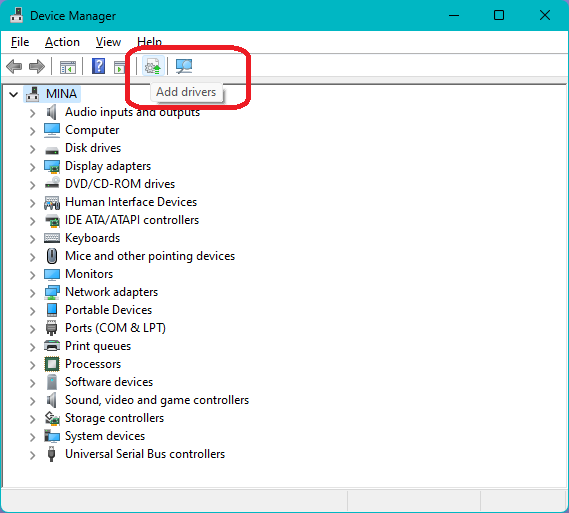
<br/>
(Click the Device Manager **Add Drivers** icon)

The Add Drivers dialog will launch.
As in the previous section, click **Browse** to specify the folder location of the driver package, and then click **Next**.

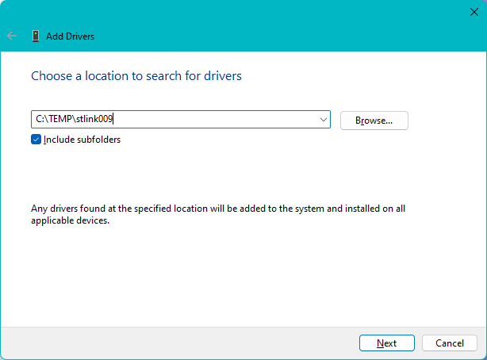
<br/>
(Add Drivers dialog)

The device-first procedure installs quickly. Displays the status of all INFs that were last installed.

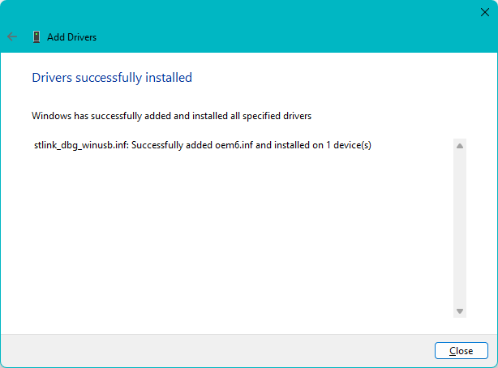
<br/>
(Drivers successfully installed dialog)

### PnPUtil command

You can install driver packages using the driver-first procedure from a command prompt using the PnPUtil command included in Windows.

```cmd
> pnputil /add-driver NewDriver.inf
```
 
[Reference link: PnPUtil command syntax](https://learn.microsoft.com/windows-hardware/drivers/devtest/pnputil-command-syntax?WT.mc_id=WDIT-MVP-35878)

[https://learn.microsoft.com/ja-jp/windows-hardware/drivers/devtest/pnputil-command-syntax](https://learn.microsoft.com/windows-hardware/drivers/devtest/pnputil-command-syntax?WT.mc_id=WDIT-MVP-35878)
<br/>

## Other Drivers

Other software-intensive drivers, such as file system drivers, audio processing drivers, and NDIS protocol drivers, follow the installation instructions for their respective driver architectures.
Follow the instructions provided by the driver vendor who provides the installation software or provides installation instructions.
For many drivers of this type of dedicated driver architecture, you may install the driver by right-clicking the INF and selecting "Install".

## TXTSETUP.OEM

This is an offline method to install necessary drivers before installing Windows, such as drivers for storage devices used with the C: drive. Used as a means to install drivers for storage controller boards that are not included in the Windows installation media.

[Reference link: Txtsetup.oem File](https://learn.microsoft.com/mem/configmgr/develop/osd/how-to-import-a-windows-driver-described-by-a-txtsetup-oem-file?WT.mc_id=WDIT-MVP-35878)

[https://learn.microsoft.com/mem/configmgr/develop/osd/how-to-import-a-windows-driver-described-by-a-txtsetup-oem-file](https://learn.microsoft.com/mem/configmgr/develop/osd/how-to-import-a-windows-driver-described-by-a-txtsetup-oem-file?WT.mc_id=WDIT-MVP-35878)
