# ドライバー インストール方法

HowToInstall_j.md

- [ドライバーのインストールとは？](DriverInstallation_j.md)
- **ドライバー インストール方法**
- [ドライバー更新と削除](UpdateAndDeletion_j.md)

----

## ドライバー インストール方法

ドライバーのインストールは、ドライバーパッケージをドライバーストアにコピーしてからドライバーの初期化処理を完了するまでの一連の流れです。ドライバーのインストールには次のシナリオ（方法）があります。

- デバイスファースト
- ドライバーファースト
- その他のドライバー
- TXTSETUP.OEM

ドライバーのインストールが必要な場合は通常、デバイス提供メーカーがドライバーのインストール手順を指定しているか、またはインストールプログラムを用意しているため、実際にユーザーがこれらの手順でインストールすることは少ないです。しかしWindowsのOSアップデート等でのドライバー問題発生時、あるいはメーカーが新しいバージョンのドライバーを公開した場合、あるいは後述の標準ドライバーの自動インストール問題があるので、覚えておいて損はない知識です。

## デバイスファースト手順

デバイスを先にPCに接続するか、または接続済デバイスの電源をONにする方法です。
ソフトウェアデバイス（仮想デバイス）が動作開始する場合もこれに該当します。

Windowsは プラグアンドプレイマネージャー が新しいデバイスを検出すると、適合するドライバー（実体はINF）を、INFフォルダー（**C:\Windows\INF**）、ドライバーストアと検索してインストールします。
もしドライバーが見つからない場合、以下のST-Link Debug デバイスの様にデバイスマネージャーにドライバー未インストールを示す黄色い三角マーク付きデバイスを表示します。

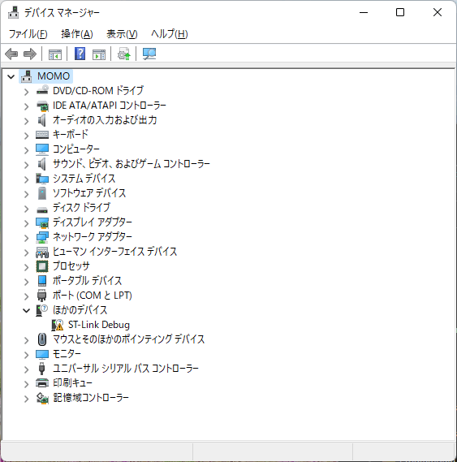
<br/>
（ドライバー未インストールを示す黄色い三角マーク付きデバイス）

このドライバー未インストールデバイスを開くと、次に示すように「このドライバーがインストールされていません」というデバイスの状態が表示されます。

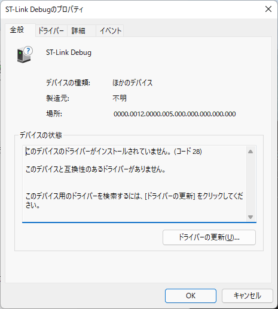
<br/>
（このST-Link Debug デバイス ドライバーがインストールされていません 表示）

もしこのシナリオで、プラグ アンドプレイマネージャー が該当するドライバーを発見した場合、すぐにドライバーのインストールを開始します。
すでにドライバーパッケージがプレインストール済なので、これは次項で説明のドライバーファーストのシナリオとなります。

 ### インストール手順

デバイスファーストのシナリオで、未検出状態の場合からのインストール手順を説明します。引き続き未インストール状態の ST-Link Debug デバイスを例にして説明します。まず対象デバイスメーカーが用意するドライバーパッケージのファイルまたはフォルダーを確認、またはローカルストレージに用意します。ドライバーパッケージはCD-ROMやUSBメモリーにあっても構いません。デバイスによっては、Windows Updateでダウンロード、インストール可能な場合もあります。この ST-Link Debug デバイスの例では STMicroelectronics社 のサイトから en.stsw-link009_v2.0.2.zip ドライバーをダウンロードしておいたので、これを展開して利用します。 

ドライバー未インストール デバイスを右クリックして、**ドライバーの更新** を選択してインストールを開始します。

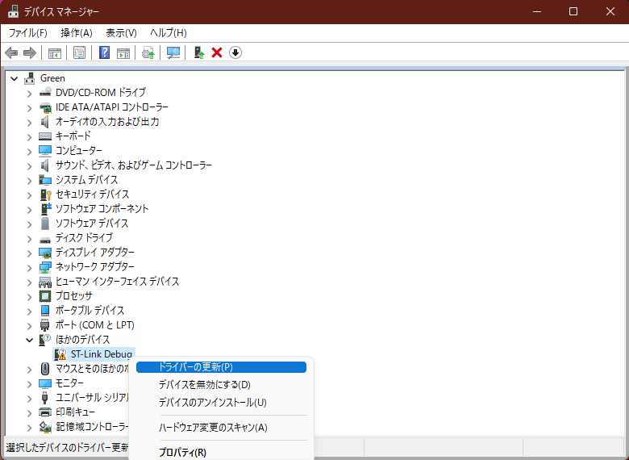
<br/>
（ドライバー未インストールの ST-Link Debug を右クリックしてドライバーの更新を選択）

次に表示されるダイアログで **コンピューターを参照してドライバーを検索** をクリックして進みます。

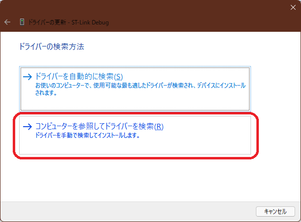
<br/>
（ドライバーの更新 ダイアログ コンピューターを参照してドライバーを検索）

ドライバーパッケージのフォルダー選択画面になるので、**コンピューター上の利用可能なドライバーの一覧から選択します** の方をクリックして進みます。

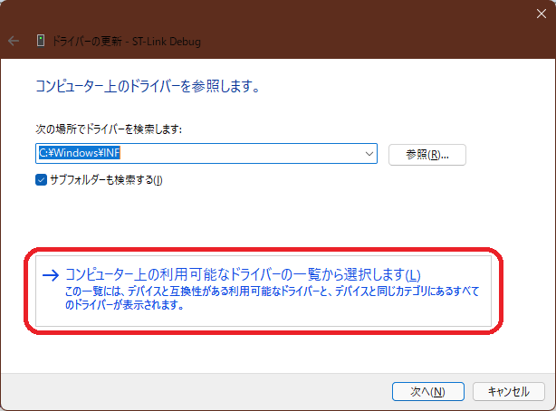
<br/>
（ドライバーの更新 ダイアログ コンピューター上の利用可能なドライバーの一覧選択）

そのまま **次へ** をクリックして進みます。

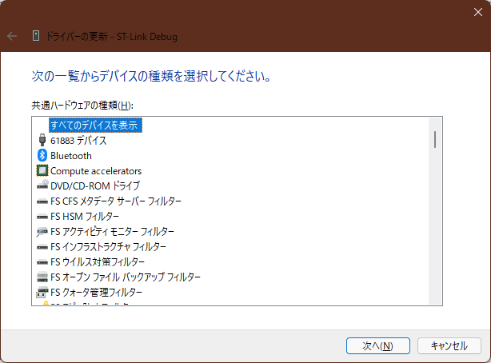
<br/>
（ドライバーの更新 一覧からデバイス種類の選択）

**ディスク使用** をクリックして進みます。

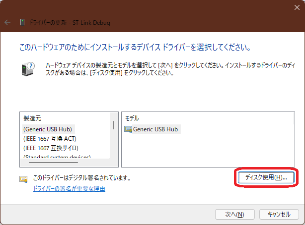
<br/>
（ドライバーの更新 **ダイアログ ディスク使用** ボタン）

参照 をクリックして 展開したフォルダー（ドライバーパッケージ）の場所を指定します。

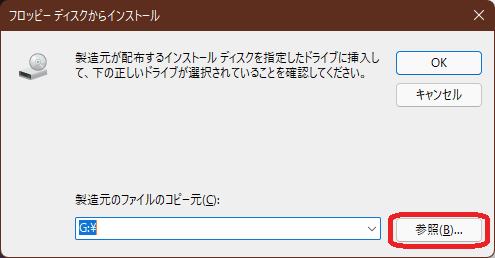
<br/>
（**フロッピーディスクからインストール** の古風なダイアログ）

ファイルの場所を指定すると INF 拡張子のファイルだけが表示されます。
この様に複数個のINFがある場合はフォルダー毎インストールされるため、どれを指定しても構いません。

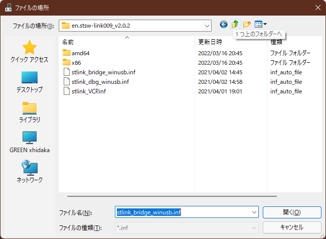
<br/>
（INF ファイルの場所 指定）

次の様に INF を含むのフォルダーの場所が確定したので **OK** をクリックして進みます。

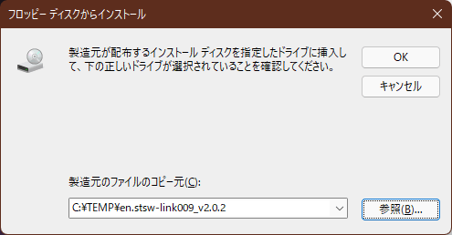
<br/>
（**フロッピーディスクからインストール** の古風なダイアログ、フォルダーの確認）

**インストールするデバイス名を確認** して **次へ** をクリックして進みます。

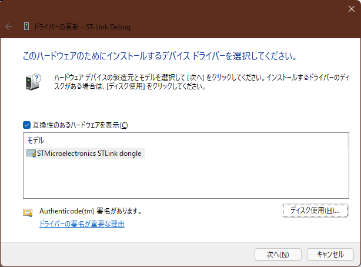
<br/>
（ドライバーの更新 ダイアログ ハードウェア名と署名を確認）

Windows セキュリティ の警告ダイアログが表示される場合があります。証明書の発行元を確認、**インストール** をクリックして進みます。

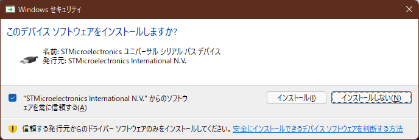
<br/>
（Windows セキュリティ このデバイス ソフトウェアをインストールしますか？ インストール ボタン）

ドライバー更新完了のダイアログが表示されます。初期化処理が正常終了して、インストール完了したことを示します。

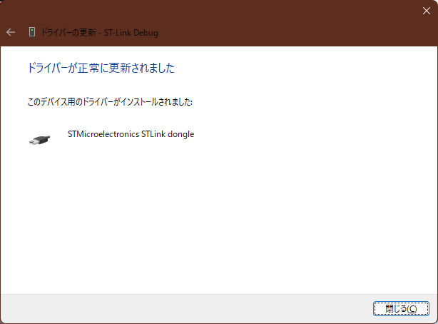
<br/>
（ドライバーの更新 正常に更新されました）

### 標準ドライバーの自動インストールと互換性問題

Windows 10では、多くの互換性があるドライバーをプレインストール（標準INFとドライバーストア）で用意する様になりました。
これにより前述の「ドライバー無し」の黄色い三角マークが付くケースが減り、外部メディアでドライバーをインストールする機会も減りました。
しかし各デバイスの性能を最大限に引き出すドライバー（最適なドライバー）が、常に自動インストールされるとは限りません。
新しいハードウェアを装着した時の自動インストールがエラー無く終了するため、そのデバイスのインストールが正常に完了した様に見えますが、最適なドライバーではないため、実際はデバイス本来の機能や性能が発揮できないケース、不具合などが発生しています。

デバイスの識別は主にベンダーIDやプロダクトIDなどから成るハードウェアIDと互換性IDで行われます。
デバイスも多様化し、様々なメーカーが様々な新しいデバイスを製品化するため、Windows は最適なドライバーを常に用意出来るとは言えません。
デバイス供給メーカーが働きかけて、最適ドライバーのインストールを誘導するのは勿論ですが、利用者も目的に合った最適なドライバーのインストールを意識する必要があります。

もしデバイスを装着するか電源をONにしただけで意図せずに自動的にドライバーがインストールされた場合、インストールメディアを用意して、前述のドライバー未インストール状態からのインストール同じ手順で目的のドライバーをインストールすることが出来ます。

[参考リンク：ハードウェアID](https://learn.microsoft.com/ja-jp/windows-hardware/drivers/install/hardware-ids?WT.mc_id=WDIT-MVP-35878)

[参考リンク：互換性ID](https://learn.microsoft.com/ja-jp/windows-hardware/drivers/install/compatible-ids?WT.mc_id=WDIT-MVP-35878)
 
## ドライバーファースト手順 ##

このシナリオでは、デバイスを説明する前にドライバーパッケージをドライバーストアにコピーします。
そのため利用する実デバイスが無くてもドライバーのインストールが出来ます。
本当にドライバーのインストールが完了するのは、実際にデバイスを接続してドライバーの初期化が終わった時です。
ドライバーファーストのシナリオによるドライバーパッケージの追加は、様々な方法で行われます。
メーカーがデバイスとともに提供するインストールメディアやダウンロードパッケージのインストールで行われる場合があります。
ここではWindows 11 の新しいデバイスマネージャーのアイコンを使う方法と、Windows 10 等でも使えるPnPUtil のコマンドの方法を説明します。
どちらもドライバーパッケージを確認して準備しておきます。

### ドライバーの追加アイコン からのインストール ###

Windows 11では **デバイスマネージャー** のリボンメニューに、**ドライバーの追加** アイコンが出来ました。
これを使って ドライバーファースト手順でインストールをします。
**Windows 10 以前にはこのアイコンはありません。** 次項で解説の PnPUtilコマンドを使用して下さい。

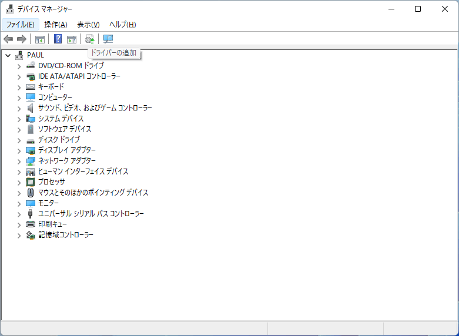
（デバイスマネージャー **ドライバーの追加** アイコン をクリック）

ドライバーの追加ダイアログが起動します。
前項と同様に **参照** をクリックしてドライバーパッケージのフォルダーの場所を指定して **次へ** をクリックします。

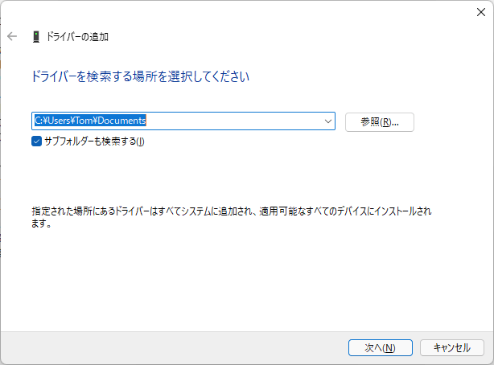
<br/>
（ドライバーの追加 ダイアログ）

Windows セキュリティ の警告ダイアログが表示される場合があります。
証明書の発行元を確認、**インストール** をクリックして進みます。

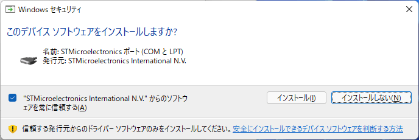
<br/>
（Windows セキュリティ このデバイス ソフトウェアをインストールしますか？）

デバイスファースト手順のインストールは直ぐに完了します。最後にインストールされた全 INF の状態が表示されます。

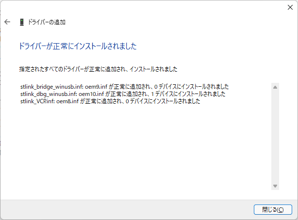
<br/>
（ドライバーの追加 ドライバーが正常にインストールされました 表示）

### PnPUtil コマンド

Windows 10などではコマンドプロンプトから、Windowsに含まれるPnPUtil コマンドでドライバーパッケージをドライバーファーストでインストール可能です。

```cmd
> pnputil /add-driver NewDriver.inf
```
 
[参考リンク：PnPUtil のコマンド構文](https://learn.microsoft.com/ja-jp/windows-hardware/drivers/devtest/pnputil-command-syntax?WT.mc_id=WDIT-MVP-35878)

[https://docs.microsoft.com/ja-jp/windows-hardware/drivers/devtest/pnputil-command-syntax](https://learn.microsoft.com/ja-jp/windows-hardware/drivers/devtest/pnputil-command-syntax?WT.mc_id=WDIT-MVP-35878)
<br/>

## その他のドライバー

ファイルシステム ドライバー、オーディオ処理ドライバー、NDIS プロトコル ドライバーなど、その他の主にソフトウェア処理を行うドライバーは、それぞれのドライバーアーキテクチャのインストール手順に従います。
ドライバー提供元ベンダーがインストールソフトウェアを用意するか、インストール手順を用意するので、その指示に従います。
この様な専用ドライバーアーキテクチャのドライバーの多くは、INFを右クリックして表示される「インストール(I)」を指定してドライバーをインストールする場合があります。
<br/>

## TXTSETUP.OEM

C:ドライブで使うストレージデバイス用のドライバーなど、Windowsのインストール前に必要なドライバーをオフライン インストールする方法です。Windowインストールメディアに含まれないストレージコントローラボード用ドライバーのインストール手段として使われます。


[https://docs.microsoft.com/mem/configmgr/develop/osd/how-to-import-a-windows-driver-described-by-a-txtsetup-oem-file](https://learn.microsoft.com/ja-jp/mem/configmgr/develop/osd/how-to-import-a-windows-driver-described-by-a-txtsetup-oem-file?WT.mc_id=WDIT-MVP-35878)
