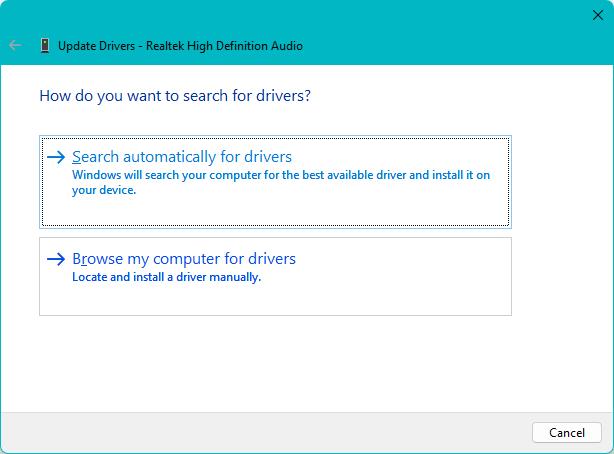
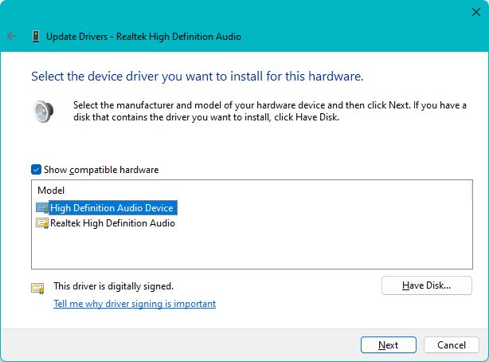

# Driver update and deletion

UpdateAndDeletion.md

- [What is Driver Installation?](DriverInstallation.md)
- [Driver installation method](HowToInstall.md)
- **Driver update and deletion**

----

We will explain how to update and delete drivers when using Windows and when you have a problem or problem, or when replacing a device or updating a driver.。

## Driver update

Here, we will use the Realtek sound driver as an example, whose compatibility and installation method have been a hot topic in some circles, to explain how to update to the desired version of the driver from those already installed.
**If you have a driver package to install, please install it according to the new installation procedure.**

If your driver is causing any issues, this method may resolve the issue by trying a different driver that is more suitable for your controller chip.
This procedure can also be used to replace the standard driver that was automatically assigned during the device-first installation with the appropriate manufacturer driver.

### Update procedure

  First, update the driver under the Sound, Video, and Game Controller Drivers node in Device Manager.
  Right-click on "Realtek High Definition Audio" and select **Update Driver**.


<br/>
(Driver update on Device Manager)

Under Search for drivers, select **Browse my computer for drivers**.


<br/>
(Browse my computer for drivers)

Click **Browse my computer for drivers**


<br/>
(Browse for drivers on your computer)

At select the device driver you want to install for this hardware dialogue,
make sure **Show compatible hardware** on screen is checked and **Select the driver you want to install from the model view** and click **Next** to proceed. 


<br/>
(Select the device driver you want to install for this hardware)

When the update installation is complete, click **Close** to exit.


<br/>
(Windows has successfully updated your drivers)

## Delete driver

Here are the steps to remove the driver. Also called device deletion.
If multiple devices of the same model are connected, the same driver will be used for them all, and the driver will be removed exactly when the last device is removed.
The terms are not strictly differentiated.

### Deletion procedure using Device Manager

This is how to delete using Device Manager.
Right-click the device you want to remove and select **Uninstall Device**.


<br/>
(Uninstall Device selection)

The Uninstall Device confirmation dialog will appear as shown below, so check **I tried to remove the driver for this device** and click **Uninstall**.


<br/>
(Uninstall device Attempted to remove this device)

The deletion is now complete.
If you have two or more devices installed that use the same driver, the **Attempted to remove the driver for this device** check box will not be displayed.

Also, if you do not check **I tried to remove the driver for this device**, the driver package will remain in the driver store, so depending on the device, it may be reinstalled immediately.
Even if reinstallation is not performed during the uninstallation operation, if there is a driver package in the driver store, it may be reinstalled by rediscovering the device by running a scan for hardware changes or by restarting the system.

###  Removal steps using PnPUtil

This is how to uninstall by starting the PnPUtil command from a command prompt started with administrator privileges.
Driver uninstallation requires his INF file name of the device to be removed located under C:\Windows\INF.
Obtain this in advance by selecting the Inf name on the details tab of the device properties.

The following is an example of how the INF file name of a Realtek(R) Audio device is displayed.


<br/>
(Inf name property on details tab)

This example removes (uninstalls) the driver with the INF file name **oem7.inf** and also removes the driver package from the driver store. The bold text is the input part.

```cmd
> pnputil /delete-driver oem7.inf
```

If the following error occurs depending on the situation, such as when the device is in use, add the /force option to forcibly delete it.

```cmd
> pnputil /delete-driver oem7.inf /force
```

This shows the actual operating situation.


(Command prompt PnPUtil execution example)

### Removing unexecuted packages with PnPUtil

It is possible to use PnPUtil to remove installed drivers that are not visible in Device Manager from the driver package.
Since the INF file name is required to execute the deletion, it is necessary to check under C:\Windows\INF and carefully confirm the INF name to be deleted.

The INF file name of a driver installed from the driver store, also known as an OEM driver package, is handled as it is replaced with a number name starting with his OEM in the format OEM99.INF under C:\Windows\INF during installation (preinstallation).
You need to be careful.
