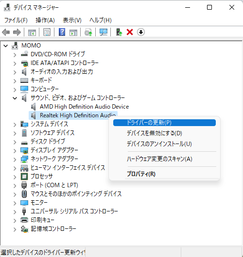
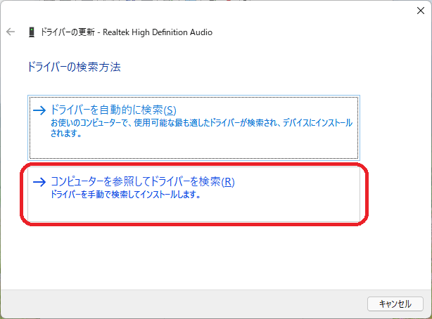
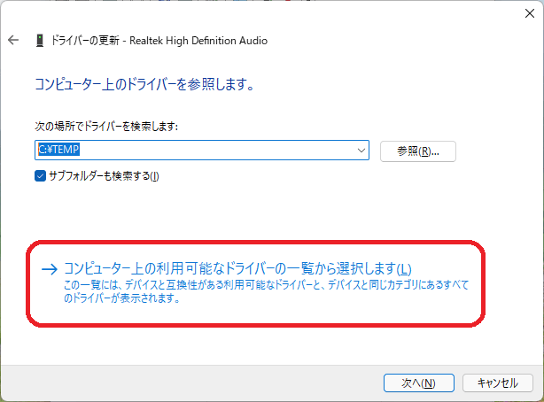
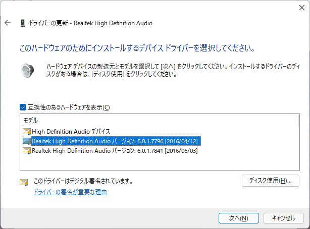
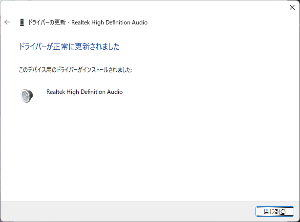
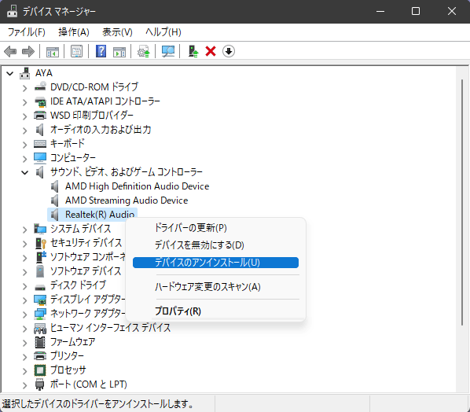
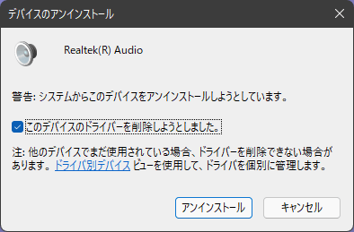
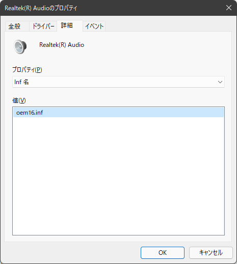
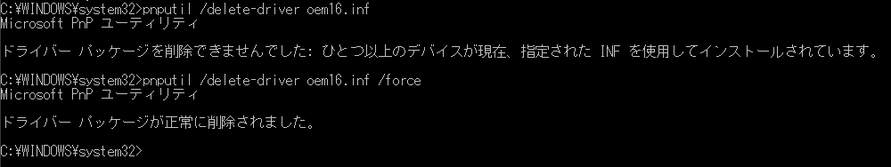

# ドライバー更新と削除

UpdateAndDeletion_j.md

- [ドライバーのインストールとは？](DriverInstallation_j.md)
- [ドライバー インストール方法](HowToInstall_j.md)
- **ドライバー更新と削除**

----

Windowsを使用していて不具合や問題、あるいはデバイスの交換やドライバーの更新の際に使う、ドライバーの更新と削除方法を解説します。

## ドライバーの更新

ここでは、一部で互換性やインストール方法が話題になっている Realtek社製サウンドドライバーを例に、すでにインストール済の中から、任意バージョンのドライバーへの更新方法を説明します。
**インストール対象のドライバーパッケージを持っている場合は、新規インストールの手順に従ってインストールして下さい。**

ドライバーが原因で何らかの問題が発生している場合、この方法でコントローラーチップにより適した別のドライバーを試すことにより、問題が解決するかも知れません。またこの手順は、デバイスファースト手順でインストールした際に自動的に割り当てられた標準ドライバーを、適切なメーカー製ドライバーと入れ替える場合にも使えます。

### 更新手順

 まずデバイスマネージャーの サウンド、ビデオ、およびゲームコントローラー のドライバーノードの下にあるドライバーを更新対象の「Realtek High Definition Audio」を右クリックして、**ドライバーの更新** を選択します。


<br/>
（ドライバーの更新）

ドライバーの検索方法で、**コンピューターを参照してドライバーを検索** を選択します。


<br/>
（コンピューターを参照してドライバーを検索）

**コンピューター上の利用可能なドライバーの一覧から選択します** をクリック


<br/>
（コンピューターを参照してドライバーを検索）

このハードウェアのためにインストールするデバイスドライバーを選択してください 画面で互換性があるハードウェアを表示にチェックが付いていることを確認して、**モデル 表示の中からインストールするドライバーを選択** して、**次へ** をクリックして進みます。
（この例では Realtek High Definition Audio バージョン: 6.0.1.7796 [2016/04/12] を選択） 


<br/>
（このハードウェアのためにインストールするデバイスドライバーを選択してください）

更新インストールが完了するので **閉じる** をクリックして終了します。


<br/>
（ドライバーが正常に更新されました）

## ドライバーの削除

 ドライバーの削除手順を示します。デバイスの削除とも呼ぶことがあります。同じ型式のデバイスが複数個接続している場合、そのデバイス用には全て同じドライバーが使われ、正確には最後の1個のデバイスが削除されるときにドライバーが削除されます。用語としては厳密に使い分けしていません。

### デバイスマネージャーでの削除手順

デバイスマネージャーを使用した削除方法です。削除対象のデバイスを右クリックして、**デバイスのアンインストール** を選択します。


<br/>
（デバイスのアンインストール 選択）

以下の様に デバイスのアンインストール 確認ダイアログが表示されるので、**このデバイスのドライバーを削除しようとしました** にチェックを入れて、**アンインストール** をクリックします。


<br/>
（デバイスのアンインストール このデバイスを削除しようとしました）

これで削除が完了します。同じドライバーを使用しているデバイスが2個以上インストールされている場合は、**このデバイスのドライバーを削除しようとしました** のチェックボックスは表示されません。

またこの **このデバイスのドライバーを削除しようとしました** にチェックをしない場合は、ドライバーストアにドライバーパッケージが残るため、デバイスによっては直ぐに再インストールが実行される場合があります。
アンインストール操作時に再インストールが実行されなかった場合でも、ドライバーストアにドライバーパッケージがある場合は、ハードウェア変更のスキャン実行などによるデバイスの再発見やシステムの再起動によって、再インストールされる場合があります。

### PnPUtil による削除手順

管理者権限で起動したコマンドプロンプトから、PnPUtil コマンドを起動してアンインストールする方法です。
ドライバーのアンインストールには、C:\Windows\INF 以下にある削除対象デバイスの INFファイル名が必要です。これはデバイスのプロパティの詳細タブ、Inf 名 を選択して事前に取得しておきます。

以下は Realtek(R) Audio デバイスのINFファイル名の表示例です。


<br/>
（詳細タブのInf 名プロパティ）

この例は oem16.inf のINFファイル名のドライバーを削除（アンインストール）し、ドライバーストアのドライバーパッケージも削除します。太字が入力部です。

```cmd
> pnputil /delete-driver oem16.inf
```

デバイスが使用中の場合など、状況によっては以下の様にエラーが出る場合は /force オプションを付加して強制削除します。

```cmd
> pnputil /delete-driver oem16.inf /force
```

実際に動作させた状況を示します。


（コマンドプロンプト PnPUtil 実行例）

### PnPUtil による未実行パッケージの削除

PnPUtilを使用して、デバイスマネージャーに表示されないインストール済ドライバーをドライバーパッケージから削除することが可能です。
削除実行には INFファイル名が必要のため、C:\Windows\INF 以下を調べて、削除対象のINF名を良く確認する必要があります。

OEM ドライバー パッケージとも呼ぶドライバーストアからインストールされるドライバーのINF ファイル名は、インストール（プレインストール）時にC:\Windows\INF 以下にOEM99.INF 形式の OEM で始まる番号名に置き換えられるので、取り扱いに注意が必要です。

